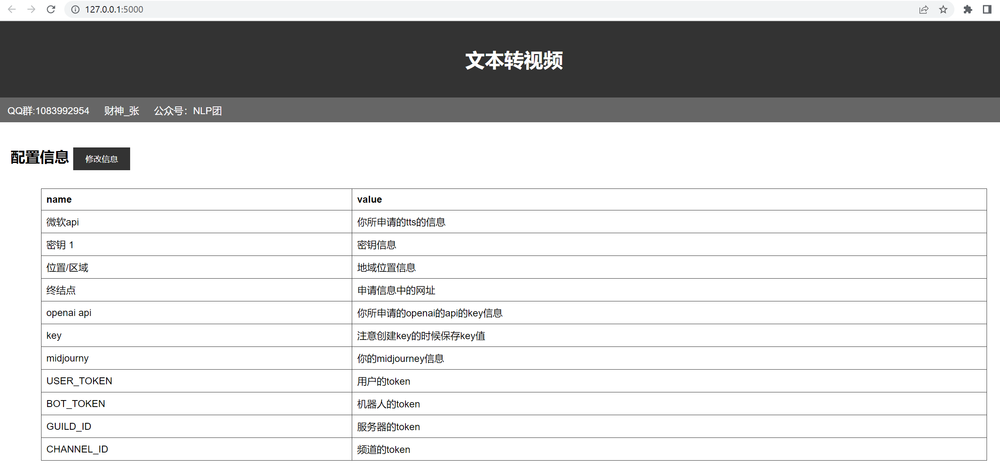
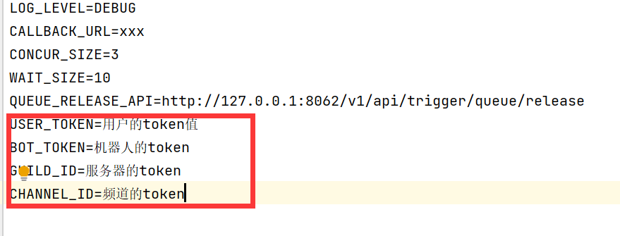
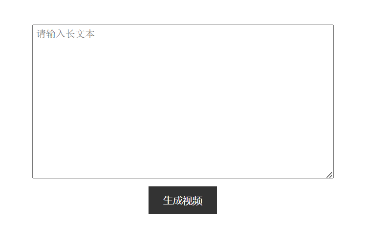

<center><h1>Text_To_Video </h1></center>

<h2>介绍</h2>

Text_To_Video_Web 是一个利用本文直接生成视频的项目，可以帮助广大自媒体应用者快速批量生产视频，本项目都是远程调用，避免的网友显卡资源不充足的情况。该项目主要是集成了chatgpt、midjourney、免费的tts服务，最终利用moviepy合成视频。


Text_To_Video_Web 项目旨在与开源社区一起推动智能项目的工程落地与发展，恳请开发者和大家遵守开源协议，勿将项目代码及基于项目产生的衍生物用于任何可能给国家和社会带来危害的用途以及用于任何未经过安全评估和备案的服务。
该项目后续会出os应用和安卓应用

<h2>使用方式</h2>

<h3>版本要求</h3>

工程代码是在python的3.10版本上运行的，建议保持python版本一致
```shell
pip install -r requirements.txt
```


<h3>环境准备</h3>
1、 申请openai官网的api的key。

2、 如果你想使用midjourney，需要准备以下四个token

```python
#用户的token值
#机器人的token
#服务器的token
#频道的token
```

3、 在网页[http://127.0.0.1:5000/](http://127.0.0.1:5000/)中替换自己的信息

4、 如果你选用了midjourney，在midjourney/.env中替换你自己的信息

5、 如果没有选用midjourney，2和4可以省略。

<h3>项目启动</h3>

1、 直接运行根目录下的app.py

2、 打开浏览器[http://127.0.0.1:5000/](http://127.0.0.1:5000/)，如下图，修改你本人的信息。微软的tts信息和openai的信息是必填的。

  

3、如果你选用了midjourney信息，还需要修改midjourney/.env的信息。

  

4、启动midjourney下的server.py和task_bot.py。


<h3>视频生成</h3>

项目正式启动后，直接在文本框中输入内容，点击生成视频即可。

  

生成的视频会保存在data/data_vedio中，midjourney的视频会保存在data/data_vedio_midjourney中。


<h2>代码阅读</h2>

代码执行逻辑流程如下：
+ 0、项目启动。
+ 1、切割源文件，句号分割语料，形成新的文件。
+ 2、利用chatgpt生成提示词，prompt。
+ 3、利用第1步的语料，调用tts的api生成语音。
+ 4、利用第2步生成提示词，调用openai的api生成图片。或者调用midjourney的api生成视频。
+ 5、将第3步的语音和第4步的图片合成视频。

分别对应：
```python
#app.py
#data_split.py
#data_promt_words.py
#data_tts.py
#data_to_image.py
#data_to_vedio.py
#data_to_image_midjourney
#image_split.py
#data_to_image_midjourney.py
```

<h2>协议</h2>

本仓库的代码依照 Apache-2.0 协议开源。
<h2>严禁</h2>

未经许可，严禁商用。


<h2>欢迎关注公众号与知识星球</h2>QQ群：1083992954


